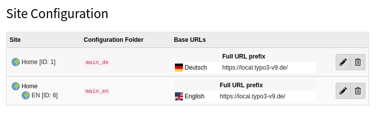
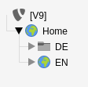

# in2altroute

## About

in2altroute is an alternative TYPO3 site identifier middleware that allows for multiple domains without language slug.
Assuming following site configuration (the hierarchie is not relevant. Only the `Full URL prefix` does matter)

And the following page tree:

You can have URLs without language slugs. To make these URLs work TYPO3 needs to know which site configuration is the right one.
This package will identify the site based on the page slug.

## Configuration

No config, just install.

## Limitations

* You are able to have mutliple pages with the same slug, but only the first one found will be used.
* (Ergo) You can have only one root page. The other language version must have a slug.
+ Probably even more. No warranty here that this will do the job correctly.
